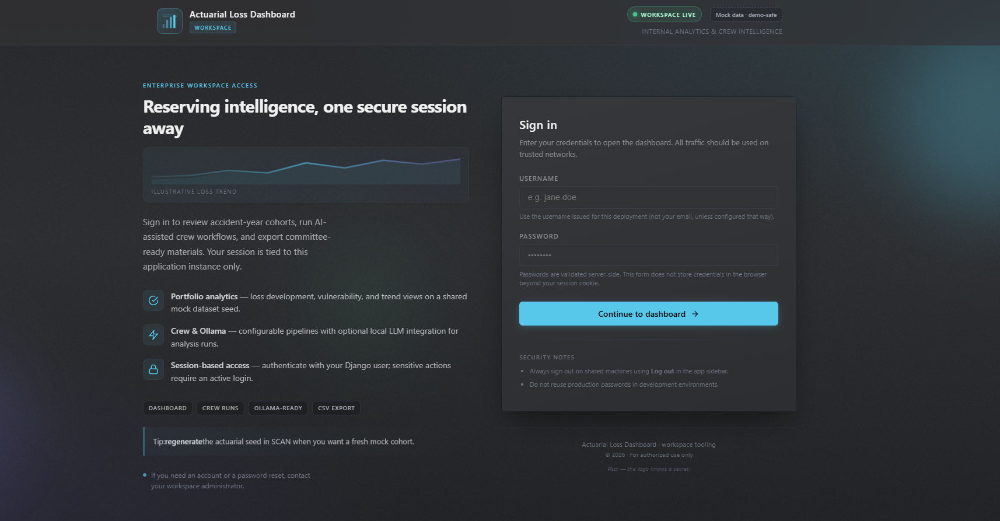
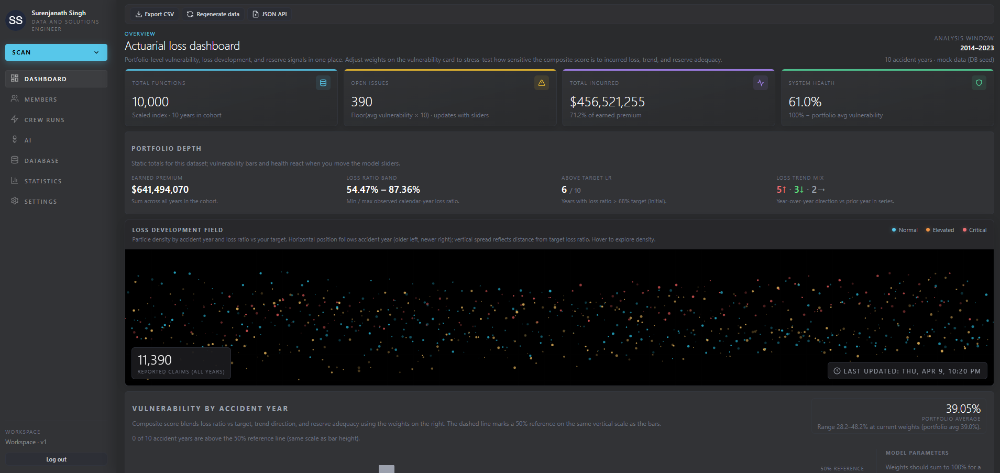
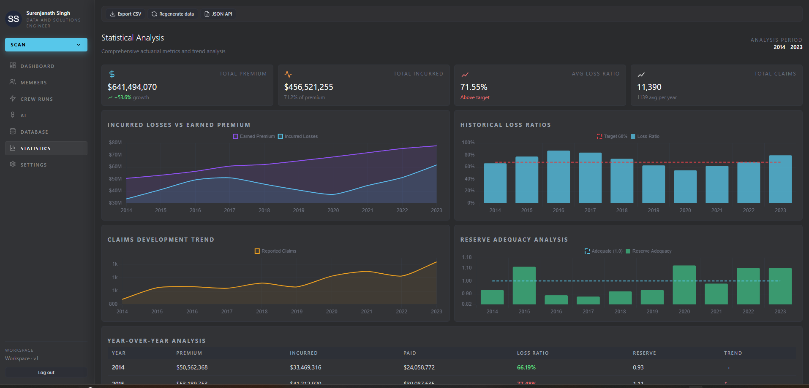
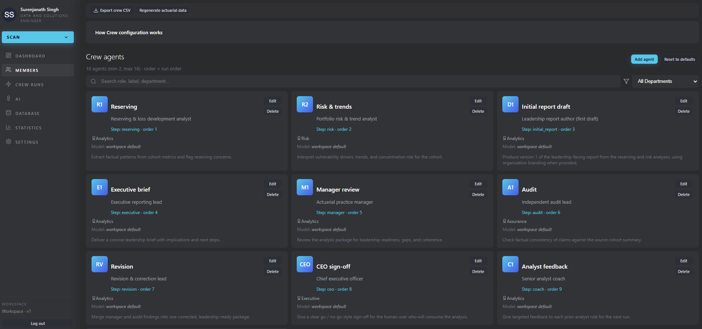
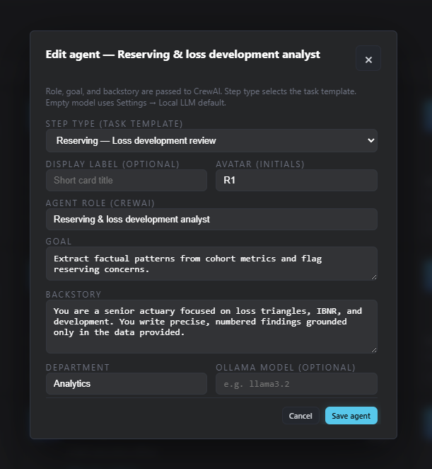
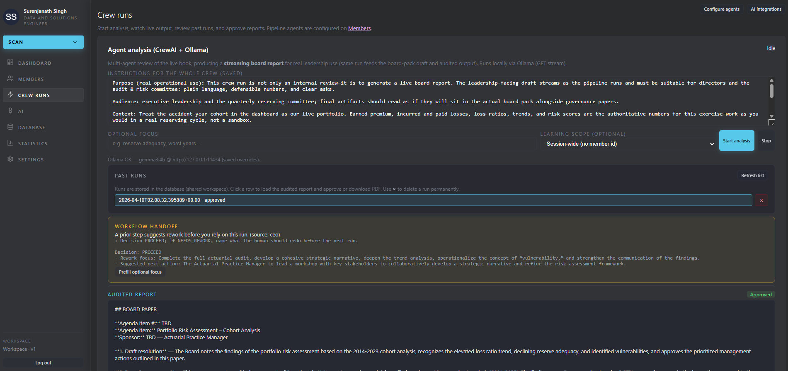
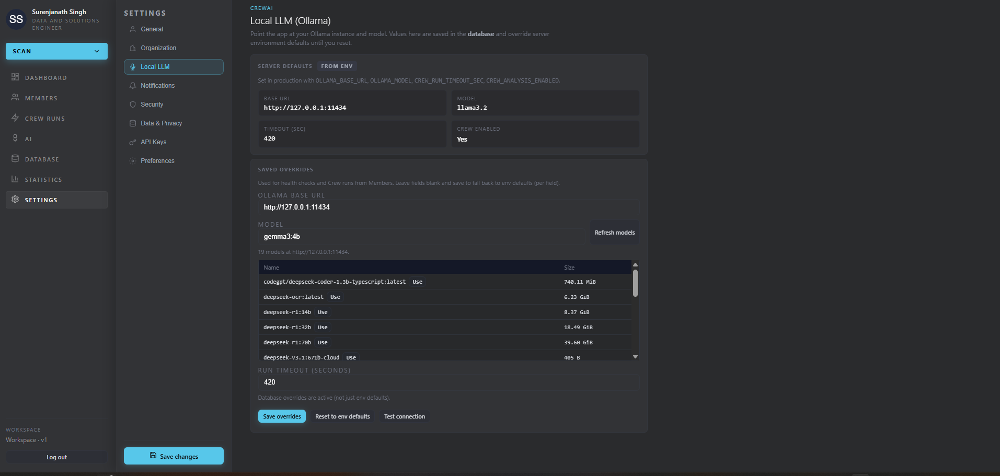

# Claims Determination — Actuarial Loss Dashboard

A **Django** web app for actuarial-style loss analytics: interactive **Dashboard**, **Database** table, **Statistics** charts, and an **AI crew** pipeline (CrewAI + local **Ollama**) for multi-agent analysis, streaming runs, approvals, and PDF reports. The UI is server-rendered with client-side charts and live crew streaming.

## Demo

**Video preview** (click the image to open the walkthrough on YouTube):

<p align="center">
  <a href="https://youtu.be/nuNXtLAnnLE" title="Watch the demo on YouTube">
    
  </a>
</p>

<p align="center">
  <a href="https://www.youtube.com/watch?v=nuNXtLAnnLE"><strong>▶ Watch on YouTube</strong></a>
</p>

## Screenshots

| Sign in | Dashboard |
|--------|-----------|
|  |  |

| Statistics | AI agents (roster) |
|------------|-------------------|
|  |  |

| AI agents — setup | AI analysis (crew run) |
|-------------------|-------------------------|
|  |  |

| Settings |
|----------|
|  |

---

## Prerequisites

- Python 3.10+ recommended
- pip
- For AI crew runs: [Ollama](https://ollama.com/) installed and a model pulled (see [CrewAI + Ollama](#crewai--ollama))

## Setup

From the `django_app/` directory:

```powershell
python -m venv .venv
.\.venv\Scripts\Activate.ps1
pip install -r requirements.txt
python manage.py migrate
python manage.py createsuperuser
```

The app uses **Django authentication**. After starting the server, sign in at **`/accounts/login/`** (or follow the redirect from `/`). Create the initial user with `createsuperuser` if the database is empty.

## Run

```powershell
python manage.py runserver
```

Open **http://127.0.0.1:8000/** after signing in. Navigation uses normal links:

- `/` — Dashboard  
- `/members/` — Crew agent pipeline (edit steps, roles, models; no live run UI)  
- `/crew/runs/` — Start crew analysis, stream output, past runs, approve, PDF  
- `/integrations/` — Hub linking Crew runs, Members, and Settings (LLM / org)  
- `/database/` — Actuarial table (sort/search via query string; client selection UI)  
- `/statistics/` — Charts (Chart.js from CDN)  
- `/settings/` — Settings panels (including **Organization** branding for crew reports)  

### Export, API, and regenerate

- `GET /export/actuarial.csv` — Download the current session’s actuarial rows as CSV.  
- `GET /export/members.csv` — Download the team roster as CSV.  
- `GET /api/actuarial.json` — JSON payload with `meta` (count, `dataset_seed`, legacy `session_seed`) and `years` (same fields as the export).  
- `POST /actions/regenerate-data/` — Draws a new mock dataset seed stored in the database (`WorkspaceState.actuarial_seed`). Send `next` (same-origin path only) to control the redirect after POST; include CSRF token (forms in the app already do).
- `GET /api/crew/health/` — JSON check for CrewAI + Ollama (reachable Ollama, model name, enabled flag).
- `GET /api/crew/stream/` — **Server-Sent Events** stream of a multi-agent analysis over the current session cohort (optional `?topic=...`). Uses the session cookie only (GET; no CSRF for EventSource). One concurrent run per session.
- `POST /api/members/customize/` — JSON body to save or clear per-member labels (`id`, optional `name`, `role`, `department`, `avatar`, `specialization`, `notes`, `ai_instructions`) or `{ "action": "clear_member", "id": "..." }`. Requires CSRF header.
- `POST /api/members/crew-instructions/` — JSON `{ "global_instructions": "..." }` for the whole-crew text block (session).
- `POST /api/members/personalization/reset/` — Clears all member overrides and global crew instructions for the session.
- `POST /api/settings/ollama/` — JSON `{ "base_url", "model", "timeout_sec" }` for **database** Ollama overrides (`WorkspaceState`), or `{ "action": "reset" }` to clear them. Used by **Settings → Local LLM**.
- `GET` / `POST /api/settings/company/` — Load or save **organization branding** (company name, address, contact fields, optional HTTPS **logo URL** and tagline) in the **`OrganizationProfile` database row** (singleton). `POST` requires a CSRF header (same pattern as other JSON APIs). Empty JSON `{}` clears stored branding. Used by **Settings → Organization**.

Toolbar actions also appear on Dashboard, Database, Statistics, and Members; the sidebar **SCAN** control opens quick links to export, JSON, database, and regenerate.

## CrewAI + Ollama

Configure agents on **Members** (`/members/`); run analysis and review history on **Crew runs** (`/crew/runs/`). The app uses a local **CrewAI** crew with **Ollama** as the LLM. Data sent to the model is a **compact summary** of the session actuarial metrics (not a raw multi-year JSON dump).

1. Install [Ollama](https://ollama.com/) and pull a model, for example:
   ```powershell
   ollama run gemma3:4b
   ```
2. Start the Ollama server (often automatic after install; otherwise run `ollama serve`). Default API URL is `http://127.0.0.1:11434`.
3. Optional environment variables (PowerShell example):
   ```powershell
   $env:OLLAMA_BASE_URL = "http://127.0.0.1:11434"
   $env:OLLAMA_MODEL = "gemma3:4b"
   $env:CREW_ANALYSIS_ENABLED = "true"
   $env:CREW_RUN_TIMEOUT_SEC = "420"
   ```
4. Open `/members/`, confirm the health line shows Ollama OK, then **Start analysis**.

If Ollama is down or misconfigured, the UI disables the run button and shows a short message. Set `CREW_ANALYSIS_ENABLED=false` to hide server-side crew execution (the panel still explains the feature).

### Session vs crew runs vs organization (what persists where)

| Data | Where it lives | When it “disappears” |
|------|----------------|----------------------|
| **Django session cookie** | Browser + server session store | New incognito window, cleared site data, or a new browser profile → **new session** |
| **Team overrides, global crew instructions, pipeline order** | **Session** (keyed by that cookie) | Same as above |
| **`CrewRun` rows (reports, steps, approval)** | **SQLite** (`db.sqlite3`), keyed by **`session_key`** copied from the session | Same **browser session** → same runs when you come back. **Different cookie** (incognito / cleared cookies) → **different `session_key`** → you **do not** see earlier runs |
| **`OrganizationProfile`** | **Database** singleton | Survives session changes; shared for the app instance |

So you “see the session before” because the **same session cookie** still maps to the same **`session_key`**, and crew history is loaded from the DB with that key. **Signed-in users** each have their own browser session; crew history is **not** shared across different sessions (and not across different `session_key` values).

### Approved report PDF (stored on disk)

When you **Approve report**, the server generates a **PDF** and saves it under **`MEDIA_ROOT`** (see `MEDIA_ROOT` / `MEDIA_URL` in settings). The file path is stored on **`CrewRun.approved_report_pdf`**. Download: **`GET /api/crew/runs/<uuid>/pdf/`** (same session as the run). In development, uploaded media is served when `DEBUG` is true.

### Run history API

- **`GET /api/crew/runs/list/`** — Up to 20 recent runs for the current session. Optional **`?member_id=...`** filters to runs for that roster member (same idea as latest).
- **`GET /api/crew/runs/<uuid>/`** — Full run (optional steps); includes flags for workflow handoff and whether an approved PDF exists.
- **`POST /api/crew/runs/<uuid>/delete/`** — Delete a run (cascades steps/events; removes stored PDF). Requires CSRF token (same as approve).

The **Crew runs** page lists **Past runs** so you can open a run, review the audited text, approve if pending, download PDF if approved, or delete a run.

### Team personalization (session)

On `/members/` you can **edit** each roster card (name, role, department, avatar initials, comma-separated focus tags, card notes, and **AI persona / priorities**). Default persona text is **prefilled** per member until you override it. The **Instructions for the whole crew** field applies to every run (default brief is prefilled when the session has no saved value). Member overrides and crew instructions are stored in the Django **session** (per browser), included in the text sent to Ollama with the actuarial summary, and reflected in **Export members CSV**. **Organization branding** is stored in the **database** and is not session-scoped. Use **Reset all** to clear member overrides, global crew instructions, and **organization branding** (same effect as **Settings → Organization → Clear** for the org row).

While a crew run is active, the **Live agent board** reflects your **pipeline** order (default includes reserving → risk → **initial report** → executive → …) with status and streaming snippets; the raw log below still captures full text.

**Default pipeline changes** do not rewrite a session that already saved a custom order. To pick up new defaults (for example the **Initial report draft** step), use **Reset to defaults** on Members or add the step manually in the pipeline editor.

### Organization branding

**Settings → Organization** persists letterhead-style fields in the **`OrganizationProfile`** table (one row, primary key `1`). They are appended to the crew kickoff (after the cohort summary) and are available to task templates via the `{company_profile}` placeholder. Logo is an **HTTPS URL** only (no file upload in this version). You can also view or edit the row in **Django admin** (`Organization profile`).

### Initial report (`initial_report`)

The default pipeline includes an **Initial report draft** step after **risk** and before **executive**. It produces a first full leadership-style draft using reserving/risk outputs plus cohort and organization context; later agents refine it. It is included in **live board report** streaming alongside `revision` and `final_report`.

### Workflow handoff (send-back, human-in-the-loop)

**Manager**, **audit**, **revision**, and **CEO** steps are prompted to end with a `## Workflow handoff` block (`Decision: PROCEED` or `NEEDS_REWORK`, plus rework focus when applicable). The app does **not** automatically rewind the CrewAI chain: you adjust instructions or **Start analysis** again, optionally using **Optional focus** after a run that requested rework.

On **Members**, when the latest stored run includes `NEEDS_REWORK`, a **Workflow handoff** callout shows an excerpt and **Prefill optional focus** when a suggested topic or snippet is available. `GET /api/crew/runs/latest/` includes a `workflow_handoff` object derived from saved step text.

### Live board report (shared draft + TV display)

- During a run, **`initial_report`**, **`revision`**, and **`final_report`** pipeline steps stream into a dedicated **Board report (live)** panel on `/members/` (leadership-facing text, separate from the full per-role transcript).
- The server emits `report_draft` SSE events, persists **`CrewRunEvent`** rows (`report_draft`) and **`CrewReportVersion`** snapshots at step boundaries, and updates **`CrewRun.live_report_text`** for fast polling.
- **`GET /api/crew/runs/<uuid>/`** (same session as the run) includes **`board_url`** and **`board_token`**: open **`board_url`** on a second display for a minimal read-only page (`/crew/board/?token=...`) that polls **`GET /api/crew/runs/<uuid>/board/?token=...`**. The signed token expires after 7 days (generate a fresh link from the run detail JSON).
- **`GET /api/crew/runs/<uuid>/events/?after_seq=0&token=...`** returns incremental persisted events for audit or custom UIs.
- **`GET /api/crew/runs/list/`** — Recent runs for the session (optional **`?member_id=`**). Powers **Past runs** on Members.
- **`GET /api/crew/runs/<uuid>/pdf/`** — Download the stored approval PDF (approved runs only, same session).

### Ollama session overrides (Settings)

**Settings → Local LLM** lets you set **Ollama base URL**, **model name**, and **run timeout** for your browser session (overriding environment defaults). **Test connection** calls the same health check as the Members page. **Reset to env defaults** clears session overrides.

## Data

Mock actuarial rows are generated deterministically per browser **session** (seed stored in Django session) so Dashboard, Database, and Statistics stay consistent until the session resets.

## Static assets

CSS and JavaScript live under `actuarial/static/actuarial/`. Chart.js is loaded from jsDelivr on the Statistics page only.

Approved report PDFs are stored under **`MEDIA_ROOT`** (default: `django_app/media/`). With **`DEBUG=True`**, Django serves uploaded media at **`/media/`** (see `config/urls.py`).
